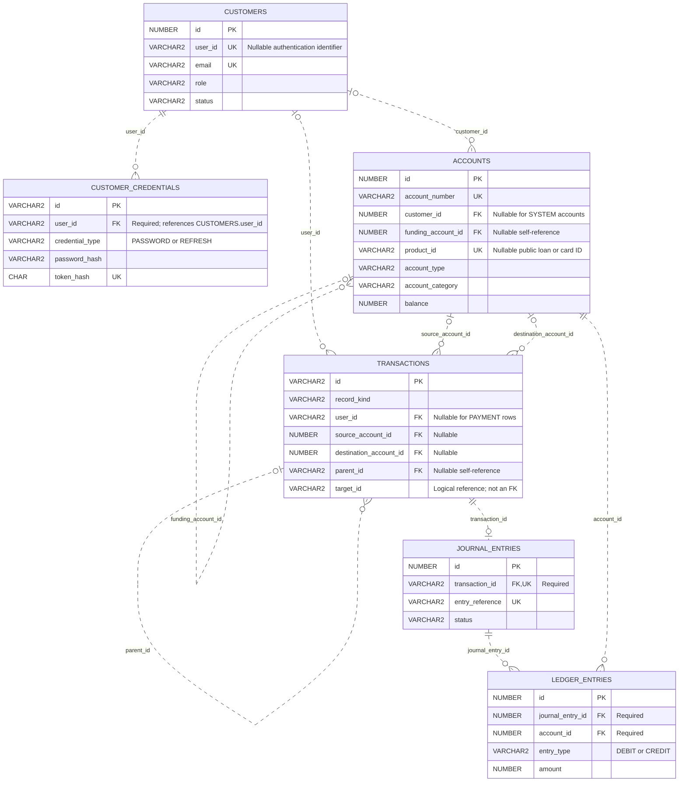
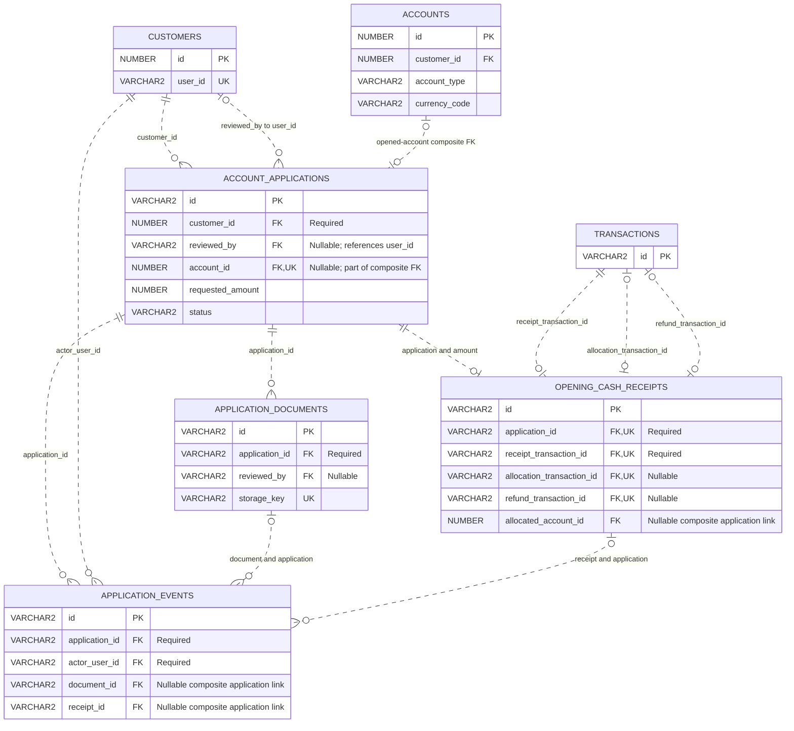
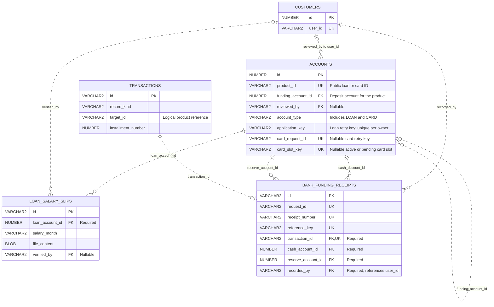
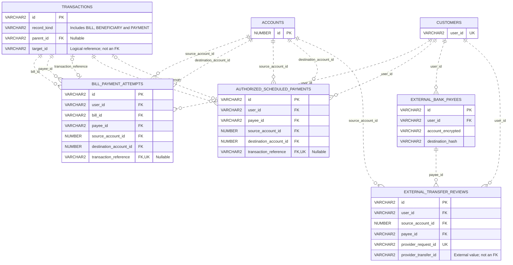
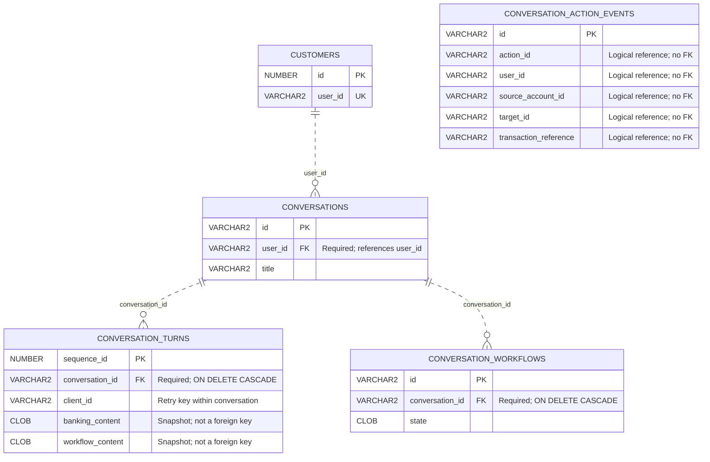

# Nexa entity relationships

This document describes the current application schema from the repository's Oracle migrations **through V32**, including Java migration V17, and the queries that use it. It is a source-based model, **not an inspection of a running Oracle database**. The diagrams show selected columns and relationships rather than every column.

The [complete Mermaid overview](diagrams/entity-relationships.mmd) includes all 20 tables below. The smaller diagrams explain each domain. See [PROJECT_ARCHITECTURE.md](PROJECT_ARCHITECTURE.md) for the application architecture.

## How to read the model

- `PK` is a primary key, `FK` a declared database foreign key, and `UK` a unique key. Oracle also uses conditional unique indexes for some business rules.
- `||` means exactly one; `|o` on a left endpoint or `o|` on a right endpoint means zero or one; `o{` means zero or many at the right endpoint. Cardinalities describe what the schema permits; application rules can be stricter.
- Diagram lines represent **actual foreign keys only**. A solid or dashed Mermaid ER line describes identifying/non-identifying notation; neither line style should be interpreted as a logical-only relationship. Logical references are explained separately in text.
- `CUSTOMERS.id` is the numeric primary key used by account ownership. `CUSTOMERS.user_id` is a separate, nullable UNIQUE authentication identifier used by credentials, chat and many audit/authorization rows. They are not interchangeable. V16 removes its former foreign key to the legacy `USERS` table.
- A foreign key to `ACCOUNTS` or `TRANSACTIONS` does not by itself enforce a row's subtype, owner or currency. The relevant checks and services enforce those additional rules.

## Current 20-table index

| Domain | Table | Purpose |
|---|---|---|
| Core | `CUSTOMERS` | Customer/staff identity, access role and profile |
| Core | `CUSTOMER_CREDENTIALS` | Password and refresh-token credentials |
| Core | `ACCOUNTS` | Deposit accounts, system accounts, loan accounts and local card records |
| Core | `TRANSACTIONS` | Posted payments and typed product/instruction/audit rows |
| Core | `JOURNAL_ENTRIES` | One accounting journal for a payment |
| Core | `LEDGER_ENTRIES` | Debit/credit legs posted to accounts |
| Onboarding | `ACCOUNT_APPLICATIONS` | Savings-account application and review state |
| Onboarding | `APPLICATION_DOCUMENTS` | Retained document metadata; document-copy uploads/review/downloads are retired |
| Onboarding | `OPENING_CASH_RECEIPTS` | Actual cash acknowledgments, allocation and refund references |
| Onboarding | `APPLICATION_EVENTS` | Immutable application transition history |
| Loans | `LOAN_SALARY_SLIPS` | Private salary-slip files stored as BLOBs, with month and review metadata |
| Bank funding | `BANK_FUNDING_RECEIPTS` | Immutable admin-recorded bank-capital receipts |
| Payments | `BILL_PAYMENT_ATTEMPTS` | Customer-reviewed internal bill-payment attempts |
| Payments | `EXTERNAL_BANK_PAYEES` | Encrypted external bank recipients |
| Payments | `EXTERNAL_TRANSFER_REVIEWS` | Cashfree sandbox transfer review and provider status |
| Payments | `AUTHORIZED_SCHEDULED_PAYMENTS` | New, explicitly authorized one-time internal transfers |
| Chat | `CONVERSATIONS` | Owned chat sessions |
| Chat | `CONVERSATION_TURNS` | Immutable exchanges and structured response snapshots |
| Chat | `CONVERSATION_WORKFLOWS` | Persisted chat payment/review state |
| Chat audit | `CONVERSATION_ACTION_EVENTS` | Action history independent of deletable conversations |

This count covers the current operational model, including retained onboarding metadata. It does not count `flyway_schema_history` or the historical tables discussed below, and is not a claim about the physical table count of a particular database.

## Core identity and accounting

`ACCOUNTS.customer_id` is nullable at column level, but the category check requires an owner for `CUSTOMER` accounts and requires NULL for `SYSTEM` accounts. Every customer can own many accounts. Account types include `SAVINGS`, `CURRENT`, `CASH`, `CLEARING`, `LOAN` and `CARD`.

The conditional password index permits at most one `PASSWORD` credential per `user_id`; refresh credentials are separate rows. `TRANSACTIONS.user_id` is optional for payment rows, while the instruction-owner check requires it for other record kinds. Payment source/destination requirements depend on transaction type: deposit, withdrawal or transfer.

`JOURNAL_ENTRIES.transaction_id` is both required and UNIQUE. Consequently a transaction has **zero or one journal**, not many. The foreign keys permit a journal with zero ledger entries; successful posting services create balanced debit and credit legs. Imported historical transactions and non-payment product rows must not be assumed to have journals.

Sources: [V11 authoritative core](../apps/api/src/main/resources/db/migration/V11__integrate_authoritative_banking_core.sql), [V16 identity and typed rows](../apps/api/src/main/resources/db/migration/V16__six_table_structure.sql), [V18 account/payment constraints](../apps/api/src/main/resources/db/migration/V18__six_table_constraints.sql), [TransactionServiceImpl](../apps/api/src/main/java/com/nexa/api/service/TransactionServiceImpl.java).

## Account onboarding

- The opened-account FK is `(account_id, customer_id, account_type, currency_code) → ACCOUNTS(id, customer_id, account_type, currency_code)`. It binds the optional opened account to the application's owner, type and currency. The nullable UNIQUE `account_id` gives a zero-or-one relationship in both directions.
- Each application has at most one opening cash receipt. `(application_id, currency_code, amount) → ACCOUNT_APPLICATIONS(id, currency_code, requested_amount)` requires the recorded receipt to match the requested amount and currency.
- `(application_id, allocated_account_id) → ACCOUNT_APPLICATIONS(id, account_id)` binds allocation to that application's opened account. This is **not a direct FK from the receipt to ACCOUNTS**.
- Receipt `received_by` is a required FK to `CUSTOMERS.user_id`; `refund_requested_by` and `refunded_by` are nullable FKs to the same alternate key. Document `reviewed_by` is also nullable. These staff-role links are omitted from the diagram to keep it readable.
- Event document/receipt links include `application_id`, preventing references to another application's child records. `(application_id,event_key)` and `(application_id,application_version)` are UNIQUE.
- `APPLICATION_DOCUMENTS` retains metadata and relationships, but current onboarding rejects document-copy upload, review and download. Current identity review uses the original document in person. This does not retire the separate loan salary-slip feature.

Sources: [V24 onboarding schema](../apps/api/src/main/resources/db/migration/V24__account_applications.sql), [V26 editable applications](../apps/api/src/main/resources/db/migration/V26__editable_account_applications.sql), [AccountApplicationService](../apps/api/src/main/java/com/nexa/api/onboarding/AccountApplicationService.java).

## Loans, local cards and bank funding

There are **no separate current LOANS or CARDS tables**. Both are `ACCOUNTS` subtypes, with a UNIQUE `product_id` used in public APIs. The nullable self-FK `funding_account_id` links the product to its funding/repayment deposit account. New loan/card workflows require the appropriate owned account; the underlying FK alone does not enforce its subtype. Loan `application_key` is unique per customer when present, while card request IDs are globally unique when present.

Loan installments are `TRANSACTIONS` rows with `record_kind='LOAN_INSTALLMENT'`. Their `target_id` refers to `ACCOUNTS.product_id` **logically, without a foreign key**. The conditional unique index on `(target_id,installment_number)` prevents duplicate installment numbers for a loan. Repayment rows can use the actual `parent_id` self-FK to reference an installment. `LOAN_SALARY_SLIPS.loan_account_id` instead references the numeric `ACCOUNTS.id`; a unique key permits one slip per loan/month. The submission service requires three monthly slips.

`BANK_FUNDING_RECEIPTS` records acknowledged bank-capital cash, with one UNIQUE posted transaction, a cash account and a distinct reserve account. Many receipts can use the same two system accounts. The recorded after-balances are immutable receipt snapshots, not additional account balances. Loan and funding postings continue through the core journal and ledger relationships above.

Sources: [V20 amortization](../apps/api/src/main/resources/db/migration/V20__loan_amortization.sql), [V21 approval and funding accounts](../apps/api/src/main/resources/db/migration/V21__admin_loan_approval_and_bank_funding.sql), [V23 salary slips](../apps/api/src/main/resources/db/migration/V23__loan_salary_slips.sql), [V31 local cards](../apps/api/src/main/resources/db/migration/V31__local_card_applications.sql), [V32 funding receipts](../apps/api/src/main/resources/db/migration/V32__bank_funding_receipts.sql), [CreditMandateService](../apps/api/src/main/java/com/nexa/api/service/CreditMandateService.java).

## Bills, payees and scheduled/external payments

All FKs in these four payment-specific tables are required except `transaction_reference` in bill attempts and authorized schedules. Those optional references are UNIQUE: each attempt/schedule can post at most one transaction, and each transaction can be used at most once within that table. `(user_id,request_key)` provides owner-scoped retry uniqueness in each review/authorization table.

Bills and internal saved payees are `TRANSACTIONS` rows, distinguished by `record_kind='BILL'` and `'BENEFICIARY'`. A bill's `target_id` holds its selected beneficiary ID as a logical link; its optional `destination_account_id` is a real FK to the recipient account. On payment, the service writes both `target_id` and the actual self-FK `parent_id` to the bill ID. A bill can have many payment attempts and posted payments. Services validate the bill/payee subtype and ownership; the generic transaction FK does not.

`AUTHORIZED_SCHEDULED_PAYMENTS` contains the new executable, explicitly authorized instructions. Old `TRANSACTIONS` rows of kind `SCHEDULED_PAYMENT` remain readable but are not enrolled in execution.

An external payee's bank account is encrypted external data, not a Nexa `ACCOUNTS` row. `EXTERNAL_TRANSFER_REVIEWS` has no FK to a posted transaction: the current Cashfree sandbox path records provider outcomes separately and does not alter Nexa balances or create journals. Do not draw a local ledger posting from this table.

Sources: [V27 bill reviews](../apps/api/src/main/resources/db/migration/V27__bill_payment_attempts.sql), [V28 external recipients](../apps/api/src/main/resources/db/migration/V28__external_bank_payees.sql), [V29 sandbox reviews](../apps/api/src/main/resources/db/migration/V29__external_transfer_reviews.sql), [V30 authorized schedules](../apps/api/src/main/resources/db/migration/V30__authorized_scheduled_payments.sql), [PaymentItemService](../apps/api/src/main/java/com/nexa/api/service/PaymentItemService.java), [BillPaymentService](../apps/api/src/main/java/com/nexa/api/service/BillPaymentService.java), [runtime product queries](../apps/api/src/main/java/com/nexa/api/repository/JdbcBankingProductRepository.java).

## Chat and independent action audit

Deleting a conversation cascades to its turns and workflows. `(conversation_id,client_id)` is UNIQUE for safe turn retries. The CLOB response/workflow snapshots may contain identifiers, but they do not create additional relational FKs.

`CONVERSATION_ACTION_EVENTS` deliberately has **no foreign keys** to conversations, workflows, customers or transactions. Its logical identifiers support audit lookup while preserving events when a chat is deleted. The isolated node in the diagram is intentional.

Sources: [V7 chat](../apps/api/src/main/resources/db/migration/V7__create_conversation_history.sql), [V8 banking snapshots](../apps/api/src/main/resources/db/migration/V8__add_structured_conversation_content.sql), [V12 workflow persistence](../apps/api/src/main/resources/db/migration/V12__conversation_workflows.sql), [V13 independent audit](../apps/api/src/main/resources/db/migration/V13__conversation_action_audit.sql), [V16 customer identity FK](../apps/api/src/main/resources/db/migration/V16__six_table_structure.sql).

## Historical tables and logical-reference boundary

Java V17 performs a **copy-only cutover**. Historical tables are excluded from the operational diagrams because the current repositories use the tables above. Their physical removal is a separate archive/verify/retire action; this documentation does not claim it has run.

The retirement inventory includes `USERS`, `AUTH_REFRESH_TOKENS`, `BANKING_PRODUCTS`, `BENEFICIARIES`, `BENEFICIARY_VERIFICATIONS`, `TRANSFERS`, `TRANSFER_APPROVALS`, `MONEY_TRANSFER_REQUESTS`, `SHOWCASE_ACTIONS`, `IDEMPOTENCY_RECORDS`, `AUDIT_EVENTS`, `OUTBOX_EVENTS`, `BANKING_ACCOUNT_MIGRATION`, `LEGACY_BANK_ACCOUNTS`, `LEGACY_TRANSACTIONS`, `LEGACY_JOURNAL_ENTRIES`, `LEGACY_LEDGER_ACCOUNTS` and `LEGACY_LEDGER_POSTINGS`.

The core `TRANSACTIONS.target_id` and general `TRANSACTIONS.transaction_reference` columns are **not foreign keys**. Their meaning depends on the row's kind/operation: loan/card product, bill, beneficiary, application, schedule or receipt. By contrast, the similarly named `transaction_reference` columns in `BILL_PAYMENT_ATTEMPTS` and `AUTHORIZED_SCHEDULED_PAYMENTS` are declared FKs. Keep that distinction when extending these diagrams.

Sources: [V17 copy-only migration](../apps/api/src/main/java/db/migration/V17__migrate_banking_products.java), [explicit retirement inventory and process](../scripts/java/SixTableCutover.java), [V16 polymorphic transaction fields](../apps/api/src/main/resources/db/migration/V16__six_table_structure.sql).
