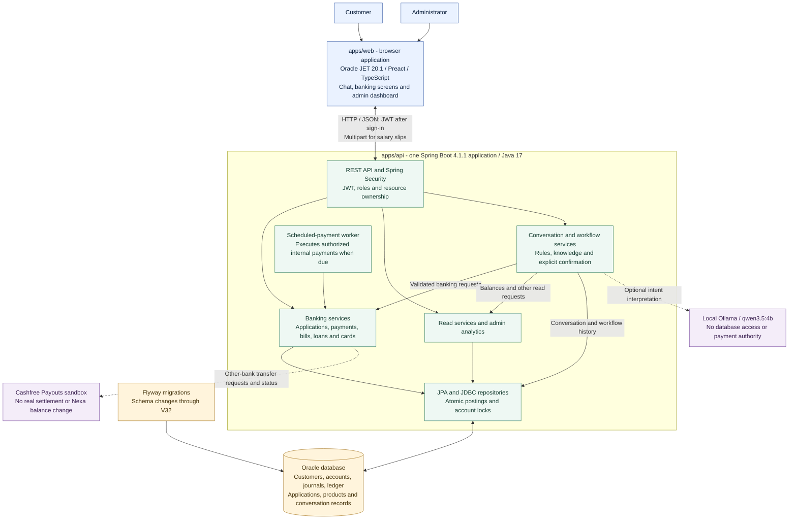

# Nexa: how the project works

Source review: 27 September 2026. This describes the current application and migrations through V32. It is a code-based view, not an inspection of a running Oracle instance.

Nexa has **one web application, one Java backend and one Oracle application schema**. Customers and administrators use different screens in the same application. Banking services enforce rules and save results; chat provides another way to reach those services.

Start with the high-level diagram below, then read the [ER diagrams and table guide](ER_DIAGRAM.md). Editable Mermaid sources are available for the [architecture](diagrams/high-level.mmd) and [complete table relationship overview](diagrams/entity-relationships.mmd).

## High-level architecture



The boxes inside `apps/api` are components of the **same backend process**, not separate microservices. Dashed arrows here indicate optional integrations. Responses return through the API to the requesting browser.

## What each layer does

| Layer | Responsibility | Location |
| --- | --- | --- |
| Web client | Sign-in, chat, forms, review/confirmation, receipts, customer and admin views. Calls the API; it cannot connect directly to Oracle. | [`apps/web/src`](../apps/web/src) |
| Security and controllers | Authenticate requests, check roles, validate incoming data and call domain services. Services also check ownership of the requested account/application. | [`security`](../apps/api/src/main/java/com/nexa/api/security), [`controller`](../apps/api/src/main/java/com/nexa/api/controller) |
| Banking services | Apply product rules, validate current balances/status, handle retry keys, approve requests and post internal money movements. | [`service`](../apps/api/src/main/java/com/nexa/api/service), [`onboarding`](../apps/api/src/main/java/com/nexa/api/onboarding) |
| Queries and analytics | Read current accounts, transaction history, products and administrator aggregates. Charts are based on database records. | [`AdminAnalyticsService`](../apps/api/src/main/java/com/nexa/api/service/AdminAnalyticsService.java), query services |
| Conversation engine | Resolve requests, read banking data and collect missing payment details. Stores chat turns and workflow state. | [`ConversationService`](../apps/api/src/main/java/com/nexa/api/service/ConversationService.java), [`WorkflowService`](../apps/api/src/main/java/com/nexa/api/service/WorkflowService.java) |
| Persistence | JPA entities and JDBC queries access Oracle; transaction boundaries keep financial updates consistent. | [`beans`](../apps/api/src/main/java/com/nexa/api/beans), [`repository`](../apps/api/src/main/java/com/nexa/api/repository) |
| Schema management | Flyway tracks ordered schema upgrades. Hibernate validates the resulting schema at startup. | [`SQL migrations`](../apps/api/src/main/resources/db/migration), [`Java V17 migration`](../apps/api/src/main/java/db/migration/V17__migrate_banking_products.java) |

The standard local runtime uses the web server on port **8000**, the API on **8088**, Oracle on **1521 / FREEPDB1**, and optional Ollama on **11434**. These are configurable defaults. The API's private configuration supplies the selected Oracle schema and credentials; the diagram does not depend on a particular developer's schema name.

**Application records persist in Oracle. H2 is used by isolated automated backend tests.** The browser displays server responses and maintains UI/session state; it is not the authoritative store for balances, bills or approvals.

## Following one internal payment

For example, a customer pays an existing Nexa recipient INR 700. The Payments page and an executable chat payment eventually use the same internal posting service.

```mermaid
sequenceDiagram
    actor Customer
    participant Web as Web or chat interface
    participant API as Security and payment workflow
    participant Banking as Transaction service
    participant DB as Oracle

    Customer->>Web: Choose source, Nexa recipient and INR 700
    Web->>API: Prepare payment review
    API->>DB: Validate ownership and save review
    API-->>Web: Exact recipient, amount and confirmation details
    Customer->>Web: Confirm the reviewed payment
    Web->>API: Confirm this saved review
    API->>Banking: Execute validated internal transfer
    Banking->>DB: Lock accounts and recheck status and funds
    alt Valid and funded
        Banking->>DB: Save payment, journal, debit and credit entries
        Banking->>DB: Update both account balances
        API->>DB: Save completed workflow or payment attempt
        Note over API,DB: Commit the related internal changes atomically
        API-->>Web: Completed receipt and transaction reference
    else Rejected or insufficient funds
        Note over Banking,DB: No partial financial posting is committed
        API-->>Web: Failure message; no successful payment receipt
    end
```

The posted `TRANSACTIONS` row identifies the payment. Its `JOURNAL_ENTRIES` row groups the accounting record; `LEDGER_ENTRIES` identifies the debit and credit against the participating accounts. Account balances change with the posting. The returned review ID identifies the confirmation being retried. Repeating an already completed confirmation returns its recorded result instead of posting again.

For a bill payment, the same database transaction also records the completed payment attempt. The remaining amount and paid status are calculated from the original invoice amount minus journal-backed posted payments; the invoice amount is preserved. An external Cashfree sandbox request follows a separate path and does not enter this ledger-posting flow.

## Main customer and administrator workflows

| Feature | How it works now | Persisted result |
| --- | --- | --- |
| Registration and login | Create a customer identity; sign-in verifies a password hash and issues access/refresh credentials. Protected requests use a JWT and server-side authorization. | `CUSTOMERS`, `CUSTOMER_CREDENTIALS` |
| Savings account opening | Customer supplies required details and intended opening amount, saves/submits the application; admin reviews it, records the actual cash received, then opens the funded account. Requested changes, rejection and refund have their own states. The receipt number is generated and its amount must match the application. | Application, events and opening cash receipt; new `ACCOUNTS` row; receipt/allocation postings |
| Nexa transfers | Select an owned source and eligible Nexa destination, review, then explicitly confirm. The backend rechecks status and available funds before posting. | Payment, journal, ledger and updated balances |
| Bills | Customer enters invoice/consumer details and can link an existing saved Nexa payee. Pay now creates a review; confirmation transfers internally and records the payment. The remaining amount is calculated from posted payments; the due date determines whether an unpaid bill is overdue. | Typed bill in `TRANSACTIONS`, `BILL_PAYMENT_ATTEMPTS`, posted payment |
| Scheduled payments | Customer reviews and authorizes a one-time internal transfer. While enabled and the API is running, the worker polls for due authorizations, normally at 30-second intervals, and executes eligible payments. Checking status only reads the record. | `AUTHORIZED_SCHEDULED_PAYMENTS`; payment/journal/ledger when successful |
| Direct debits | Customer can select a saved Nexa payee and create/manage the stored mandate. Mandate records are not connected to an external direct-debit collection network or a recurring collection worker. | Typed mandate and mandate event records in `TRANSACTIONS` |
| Loans | Customer selects loan type/account/amount/tenure and uploads three required monthly salary slips. Admin reviews and approves/rejects. Customer acceptance disburses the approved loan only if the bank lending reserve can cover it. Repayment updates principal and interest accounting. | Loan in `ACCOUNTS`, salary-slip BLOBs, installment records and financial postings |
| Bank funding | Admin records cash funding already received, including source and evidence reference. Nexa generates a separate receipt number and posts the cash/reserve accounting. This recording does not initiate a bank-network transfer. | `BANK_FUNDING_RECEIPTS`, payment, journal, ledger and reserve balance |
| Cards | Customer requests a card linked to an eligible owned account. Debit requests create an active local card record; credit requests require an admin decision and approved limit. Saved block/unblock controls affect the local card state. | Typed card in `ACCOUNTS` and audit records; application/approval creates no cash |
| Other-bank transfers | Encrypted external payee details are used for a Cashfree sandbox request. Status refresh reads the provider result and updates Nexa's external request record. | `EXTERNAL_BANK_PAYEES`, `EXTERNAL_TRANSFER_REVIEWS`; no Nexa balance or bill changes |
| Admin analytics | Admin selects a reporting window/granularity and sees actual database totals, trends and application queues. | Read-only aggregation of the existing records; no separate analytics warehouse |

## How chat fits in

A message first passes through conversation handling, deterministic intent rules, the reviewed knowledge catalogue and, when enabled, local Ollama interpretation. The server resolves any proposed intent against allowed operations and the authenticated user's data.

A balance request performs an ownership-scoped read. A supported payment request collects exact account/payee choices and an amount, presents a saved review, and requires an action-bound confirmation. The model cannot grant permission or directly change balances. Typing a casual acknowledgement does not replace the required payment confirmation.

An explicit loan application request opens the real loan form inside chat, including the required uploads. It does not manufacture a loan from chat text. Conversation history, in-progress workflows and audit events are stored separately from the banking ledger; deleting chat history does not delete posted financial records.

## Current integration boundaries

| Area | What the current implementation supports |
| --- | --- |
| External payments | Cashfree **sandbox** only. Pending is not success; a successful sandbox result still does not settle real money or debit a Nexa account. |
| Bills | Internal Nexa recipient payments. No automatic retrieval or settlement with electricity/water/telecom providers. A consumer number identifies the invoice customer, not the receiving bank account. |
| Cards | Local debit/credit product records and controls. No real PAN/CVV, physical card issuance or merchant network settlement. |
| Identity and current accounts | Savings onboarding with manual original-document confirmation. No government verification service or business/organization due-diligence flow; new current-account onboarding is disabled. |
| Automation | Only the dedicated, explicitly authorized one-time internal schedule runs through the worker. Existing mandate or legacy schedule records are not automatically executable permissions. |

## Read the source in this order

1. [`BankingApp.tsx`](../apps/web/src/features/banking/BankingApp.tsx): routes and customer/admin screens.
2. [`SecurityConfiguration.java`](../apps/api/src/main/java/com/nexa/api/security/SecurityConfiguration.java): API authorization boundary.
3. [`TransactionServiceImpl.java`](../apps/api/src/main/java/com/nexa/api/service/TransactionServiceImpl.java): core internal balance and ledger posting.
4. [`AccountApplicationService.java`](../apps/api/src/main/java/com/nexa/api/onboarding/AccountApplicationService.java), [`BillPaymentService.java`](../apps/api/src/main/java/com/nexa/api/service/BillPaymentService.java), [`LoanSettlementService.java`](../apps/api/src/main/java/com/nexa/api/service/LoanSettlementService.java): product workflows around that accounting model.
5. [`ConversationService.java`](../apps/api/src/main/java/com/nexa/api/service/ConversationService.java), [`WorkflowService.java`](../apps/api/src/main/java/com/nexa/api/service/WorkflowService.java), [`LoanApplicationChatEntry.java`](../apps/api/src/main/java/com/nexa/api/service/LoanApplicationChatEntry.java): chat reads, confirmed actions and inline application entry.
6. [`ScheduledPaymentWorker.java`](../apps/api/src/main/java/com/nexa/api/config/ScheduledPaymentWorker.java), [`ExternalTransferService.java`](../apps/api/src/main/java/com/nexa/api/external/ExternalTransferService.java): automatic execution and the provider sandbox boundary.
7. [ER diagrams](ER_DIAGRAM.md) and the migrations linked there: exact tables, keys and relationship constraints.

Runtime and technology references: [`web package.json`](../apps/web/package.json), [`API pom.xml`](../apps/api/pom.xml), [`application.properties`](../apps/api/src/main/resources/application.properties), [`application-local.properties`](../apps/api/src/main/resources/application-local.properties). Directory usage is documented in [Repository layout](REPOSITORY_LAYOUT.md).
